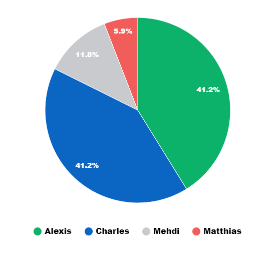

# NoSQL

Projet scolaire de fin de matière (NoSQL).

## Consignes

Créer et monter une petite API avec une base de données.
En premier, nous devions utiliser uniquement Redis pour stocker les données. Puis ensuite, nous avons choisis d'intégrer MongoDB pour stocker les données de manière plus pérenne et de garder Redis pour une utilisation de cache.

## Répartition des tâches

Le graphique parle de lui-même.



## Installation

1. Cloner le projet

```bash
git clone https://github.com/UnEpicier/NoSQL.git
```

2. Installer les dépendances

```bash
npm ci
```

```bash
docker compose up -d
```

4. Lancer le serveur

```bash
npm start
```

## Utilisation

-   Les routes API sont accessibles depuis l'URL `http://localhost:3000/`.
-   La documentation de ces routes est accessibles depuis l'URL `http://localhost:3000/api-docs`.
-   L'interface de MongoDB est accessible depuis l'URL `http://localhost:8081`.
-   L'interface de Redis est accessible depuis l'URL `http://localhost:8001`.

## Participants

-   VASSEUR Alexis
-   BRUN Charles
-   BATGUZERE Matthias
-   SENHAJ Mehdi
